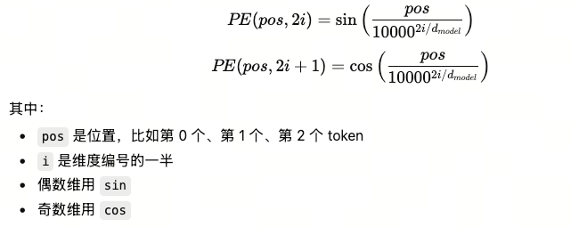

# Transformer-go
通过go去实现一个toy transformer架构，期望做到：
1. 能通过小数据集进行训练，比如[tiny_shakespeare](https://github.com/karpathy/char-rnn/blob/master/data/tinyshakespeare/input.txt)
2. 训练后的模型在指定的场景下能够收敛

# 架构总览
按照Attention is All You Need的架构去进行实现


# 实现路线
1. encoder only：
   1. next-token prediction(hell->o)
   2. UCI SMS Spam Collection(邮件分类)
2. encoder+decoder：
   1. 回文串生成
   2. tiny Shakespeare

# 核心架构

## Tokenizer
Tokenizer的职责是将输入内容(此处是文本)切分为token，并映射到词表里的tokenIDs，也能够将输出的tokenID转换回文本

通过tiktoken-go来实现，tiktoken能做到：
1. 把文本编码成 token IDs
2. 把 token IDs 解码回文本
3. 按不同的encoding规则分词（选择不同的词表）

```go
type Tokenizer interface {
	Encode(text string) ([]int, error)
	Decode(tokenIDs []int) (string, error)
	EncodingName() string
}

type TikTokenizer struct {
	enc          *tiktoken.Tiktoken
	encodingName string
}

func NewTikTokenizer(encodingName string) (*TikTokenizer, error) {
	enc, err := tiktoken.GetEncoding(encodingName)
	if err != nil {
		return nil, err
	}

	return &TikTokenizer{
		enc:          enc,
		encodingName: encodingName,
	}, nil
}

func (t *TikTokenizer) Encode(text string) ([]int, error) {
	return t.enc.Encode(text, nil, nil), nil
}

func (t *TikTokenizer) Decode(tokenIDs []int) (string, error) {
	return t.enc.Decode(tokenIDs), nil
}

func (t *TikTokenizer) EncodingName() string {
	return t.encodingName
}
```

## Embedder
Embedder的职责是token IDs与向量的相互转换，含义相似的单词在这个高维空间中应当是相邻的

如果词表大小是 V，embedding 维度是 d_model，那会有一个矩阵：

`E∈R^V×d_model`

其中：
- 每一行对应一个 token id
- 每一行就是这个 token 的向量

初始的E就是随机化的一个矩阵，通过backwards来训练
使用Xavier / Glorot这种主流算法来初始化

```go
type Embedder interface {
	TokenIDsToVectors(tokenIDs []int) [][]float64
	VocabSize() int // 可接受的tokenID映射范围
	Dim() int // 维度
}

type EmbedderConfig struct {
	VocabSize int
	Dim       int
	Weights   [][]float64
}

type TextEmbedder struct {
	weights [][]float64
}

func NewTextEmbedder(vocabSize, dim int) *TextEmbedder {
	return &TextEmbedder{}
}

func NewTextEmbedderFromConfig(cfg EmbedderConfig) *TextEmbedder {
	return &TextEmbedder{
		weights: cfg.Weights,
	}
}
```

## Positional Encoder
Positional Encoder的职责是注入token绝对位置的信息，让模型能够利用到序列的顺序

在这一步之前，已经得到了`seq_len(序列长度) × d_model(维度)`的一个矩阵X，
Positional Encoder会生成一个同样大小的矩阵PE

最后得到的矩阵`X′=X+PE`
每个维度的变化速度都不相同，最终，模型就能判断出token在不同位置的关系

```go
type PositionalEncoder interface {
	PositionInject(vectors [][]float64) [][]float64
	Dim() int
}
```
## Calculator
这里我将论文中 Multi-Head Attention -> Add&Norm -> Feed Forward -> Add&Norm 这个流程封装到算子里

Multi-Head Attention：多Attention并行运算，计算当前位置的token与其他token的相关性，达到聚合其他位置的信息
```go
type MultiHeadAttention interface {
	Execute(input [][]float64) [][]float64
	attention(Q, K, V [][]float64) [][]float64
}

// VecY = VecX x Weight + Bias
type Linear interface {
	Forward(input [][]float64) [][]float64
	InputDim() int
	OutputDim() int
}

type LinearConfig struct {
	InputDim  int
	OutputDim int
	Weights   [][]float64
	Bias      []float64
}

type TextLinear struct {
	weights   [][]float64
	bias      []float64
	inputDim  int
	outputDim int
}

func NewLinear(inputDim, outputDim int) *TextLinear {
	return &TextLinear{}
}

func NewLinearFromConfig(cfg LinearConfig) *TextLinear {
	return &TextLinear{}
}

type MultiHeadAttentionConfig struct {
	Heads int
}

type TextMultiHeadAttention struct {
	qLinear   Linear
	kLinear   Linear
	vLinear   Linear
	outLinear Linear
	heads     int
}

func NewTextMultiHeadAttention(
	qLinear Linear,
	kLinear Linear,
	vLinear Linear,
	outLinear Linear,
	heads int,
) *TextMultiHeadAttention {
	return &TextMultiHeadAttention{}
}
```
Add&Norm：Multi-Head Attention与Feed Forward都会经过这一层，作用是保留原输入并叠加新信息，再把结果归一化
- Add：把子层输出和原输入相加 保留原始信息且梯度更容易传下去
- Norm：对相加后的每个 token 向量做归一化 防止数值尺度失控，使得训练不稳定，这里使用的是Transformer常用的layerNorm
```go
type LayerNormConfig struct {
	Gamma []float64
	Beta  []float64
	Eps   float64
}

type LayerNorm struct {
	gamma []float64
	beta  []float64
	eps   float64
}

func NewLayerNorm(dim int, eps float64) *LayerNorm {
	return &LayerNorm{}
}

func NewLayerNormFromConfig(cfg LayerNormConfig) *LayerNorm {
	return &LayerNorm{}
}

func Add(input, residual [][]float64) [][]float64 {
	return nil
}

func (n *LayerNorm) Norm(input [][]float64) [][]float64 {
	return nil
}
```
Feed Forward：对每个 token 的表示单独做非线性映射，强化/抑制某些维度，以提升表达能力，整个流程是Linear -> Activation -> Linear
```go
type ActivationFunc func(x []float64) []float64

func ReLU(x []float64) []float64

type FeedForwardConfig struct {
	Linear1 LinearConfig
	Linear2 LinearConfig
}

type FeedForward struct {
	linear1 Linear
	linear2 Linear
	act     ActivationFunc
}

func NewFeedForward(linear1 Linear, linear2 Linear, act ActivationFunc) *FeedForward {
	return &FeedForward{}
}

func NewFeedForwardFromConfig(cfg FeedForwardConfig, act ActivationFunc) *FeedForward {
	return &FeedForward{}
}

func (f *FeedForward) Forward(input [][]float64) [][]float64 {
	return nil
}
```
```go
type Calculator interface {
	Calculate(input [][]float64) [][]float64
}

type TransformerCalculator struct {
	attention MultiHeadAttention
	norm1     *LayerNorm
	ffn       *FeedForward
	norm2     *LayerNorm
}

func NewTransformerCalculator(
	attention MultiHeadAttention,
	norm1 *LayerNorm,
	ffn *FeedForward,
	norm2 *LayerNorm,
) *TransformerCalculator {
	return &TransformerCalculator{}
}

func (c *TransformerCalculator) Calculate(input [][]float64) [][]float64 {
	return nil
}
```
```go
type Softmax struct{}

func NewSoftmax() *Softmax {
	return &Softmax{}
}

func (s *Softmax) Apply(input [][]float64) [][]float64 {
	return nil
}
```

## Encoder
```go
type Encoder struct {
	tokenizer         Tokenizer
	embedder          Embedder
	positionalEncoder PositionalEncoder
	calc              Calculator
	nCalc             int
}

func NewEncoder(
	tokenizer Tokenizer,
	embedder Embedder,
	positionalEncoder PositionalEncoder,
	calc Calculator,
	nCalc int,
) *Encoder {
	return &Encoder{}
}

func NewEncoderFromConfig(cfg EncoderConfig) *Encoder {
	return &Encoder{}
}

func (e *Encoder) EncodeText(text string) [][]float64 {
	return nil
}
```
```go
type Decoder struct {
	tokenizer         Tokenizer
	embedder          Embedder
	positionalEncoder PositionalEncoder
	calc              Calculator
	maskCalc          Calculator
	nCalc             int
}

func NewEncoder(
	tokenizer Tokenizer,
	embedder Embedder,
	positionalEncoder PositionalEncoder,
	calc Calculator,
	nCalc int,
) *Encoder {
	return &Encoder{}
}

func NewEncoderFromConfig(cfg EncoderConfig) *Encoder {
	return &Encoder{}
}

func (e *Encoder) EncodeText(text string) [][]float64 {
	return nil
}
```

# 性能
1. Tokenizer与Embedder使用SMAR来加快