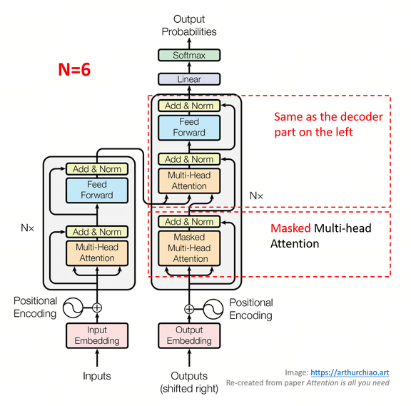

# Transformer-go
通过go去实现一个toy transformer架构

## Tokenizer
文本 -> token -> 词表里的token id
通过tiktoken-go来做

## Embedding与unEmbedding的实现
如果词表大小是 V，embedding 维度是 d_model，那会有一个矩阵：
E∈R^V×d_model
其中：
每一行对应一个 token id
每一行就是这个 token 的向量

初始的E就是随机化的一个矩阵，通过backwards来训练
使用Xavier / Glorot来初始化